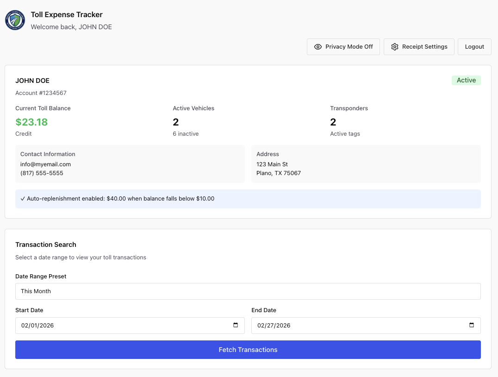
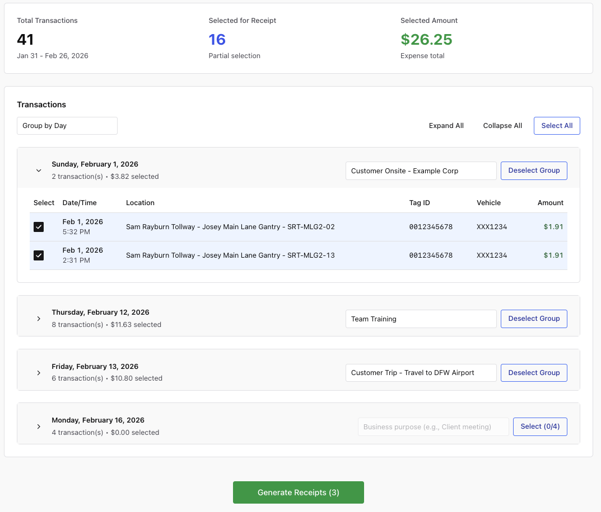

# Toll Expenser

Track and generate expense receipts for NTTA toll transactions.





## Stack

- **Worker** — [Hono](https://hono.dev) on Cloudflare Workers (TypeScript)
- **Frontend** — React 19, [Chakra UI](https://chakra-ui.com), Vite
- **PDF generation** — jsPDF + jspdf-autotable
- **Deploy** — Cloudflare Workers + Static Assets

## Development

```bash
npm install

# Terminal 1 — worker (API proxy) on :8787
npm run dev

# Terminal 2 — frontend with hot reload on :5174
npm run dev:frontend
```

The Vite dev server proxies `/api/*` to the local worker, so the full stack runs locally with no extra configuration.

## Deploy

```bash
npm run deploy
```

Builds the frontend with Vite, then deploys both the worker and static assets via `wrangler deploy`. Requires a logged-in Wrangler session (`wrangler login`) or a `CLOUDFLARE_API_TOKEN` environment variable.

## CI / CD

| Workflow    | Trigger                    | What it does                                |
| ----------- | -------------------------- | ------------------------------------------- |
| **CI**      | Every push / PR            | Type check + Vite build on Node 24 & 26     |
| **Deploy**  | CI passes on `main`        | Builds and deploys to Cloudflare Workers    |
| **Release** | Manual (workflow_dispatch) | Bumps version, tags, creates GitHub Release |

Add a `CLOUDFLARE_API_TOKEN` secret in your repository settings to enable automated deploys.

## Project structure

```
src/              Cloudflare Worker (TypeScript)
  index.ts        Hono app — NTTA API proxy + static asset fallback
frontend/         React app (Vite)
  public/         Static assets (logo, favicons, service worker)
  src/
    components/   AccountInfo, LoginForm, TransactionViewer, ReceiptSettings
    contexts/     PrivacyModeContext
    utils/        api, dateUtils, pdfGenerator, secureStorage, transactionCache, validation
dist/             Vite build output — served by Cloudflare as static assets
.github/workflows CI, Deploy, Release
```
